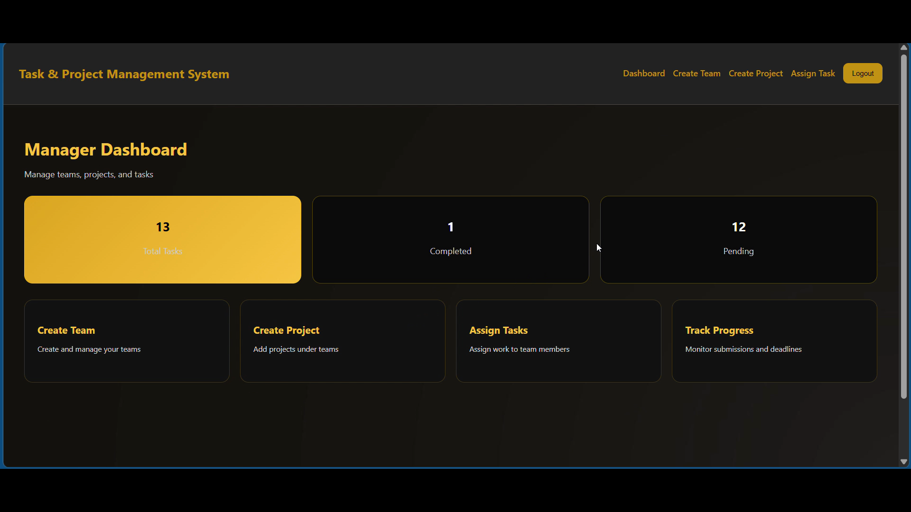
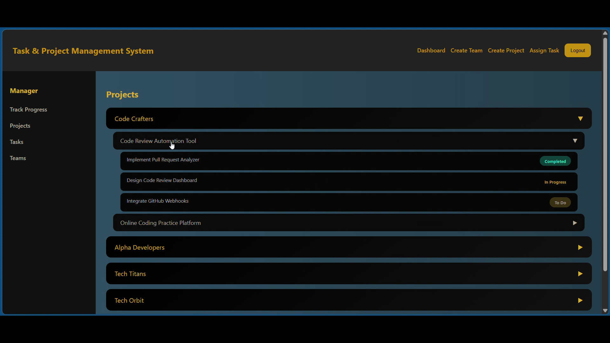
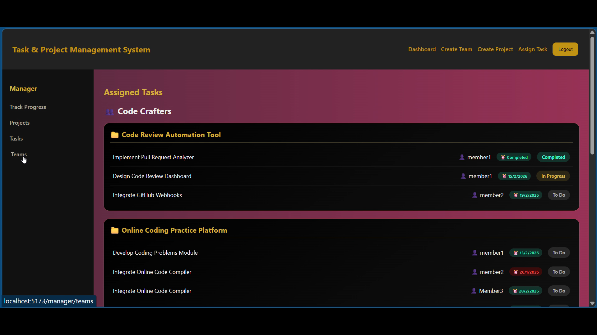
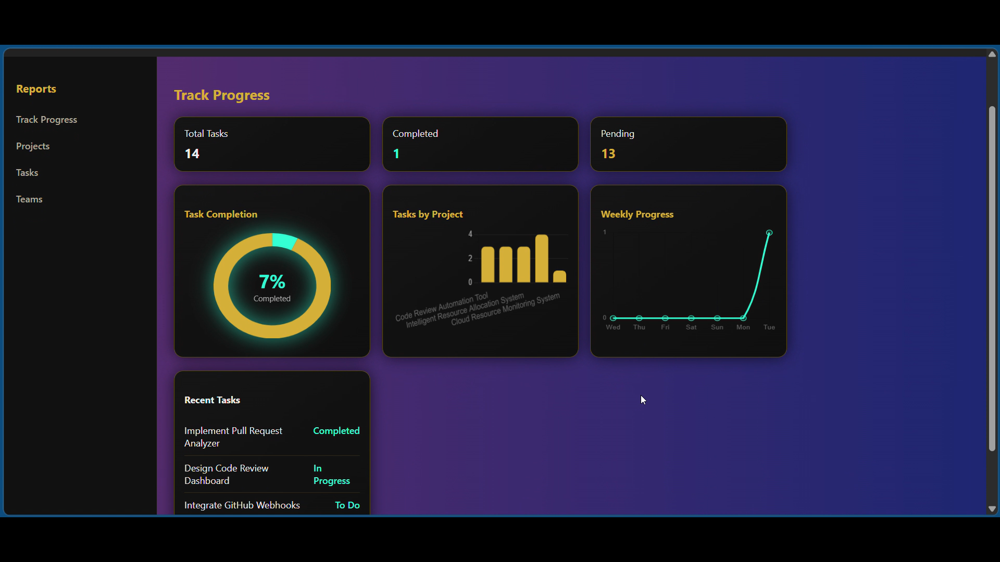

# 📋 TPMS – Task & Project Management System


> A full-stack MERN application for managing teams, projects, and tasks. The system enables managers to organize projects, assign tasks, track progress, and monitor team productivity through a centralized dashboard.

---

## 🚀 Features

### 👨‍💼 Manager
- Create and manage teams
- Create and manage projects
- Assign tasks to team members
- Track project progress
- Review task submissions

### 👨‍💻 Member
- View assigned tasks
- Submit completed work
- Upload files
- Track task status

### 🔐 Core Features
- JWT Authentication
- Role-Based Access Control
- File Upload Support
- Progress Tracking Dashboard

---

## 🛠 Tech Stack

| Category | Technology |
|-----------|-----------|
| Frontend | React, Vite |
| Backend | Node.js, Express.js |
| Database | MongoDB |
| Authentication | JWT, bcryptjs |
| File Upload | Multer |
| Charts | Chart.js |
| API Calls | Axios |

---

## 🏗️ Architecture

```text
Manager / Member
        │
        ▼
   React Frontend
        │
        ▼
    Express API
        │
        ▼
      MongoDB
```

---

## 📂 Project Structure

```text
project-management/
│
├── frontend/
├── backend/
├── screenshots/
└── README.md
```

---

## ⚙️ Setup

### Backend

```bash
cd backend
npm install
node server.js
```

### Frontend

```bash
cd frontend
npm install
npm run dev
```

---

## 📸 Screenshots

| Dashboard | Projects |
|------------|----------|
|  |  |

| Tasks | Progress |
|--------|----------|
|  |  |

---

## 📈 Highlights

- Team Management System
- Project Tracking
- Task Assignment Workflow
- Secure Authentication
- File Upload Functionality
- Progress Analytics

---

## 🎯 Future Enhancements

- Real-Time Notifications
- Team Chat
- Kanban Board
- Email Alerts
- Mobile App Support

---

## 👩‍💻 Author

**Triveni Manjunath**

Bachelor of Engineering (Computer Science)

⭐ If you found this project useful, consider giving it a star on GitHub.